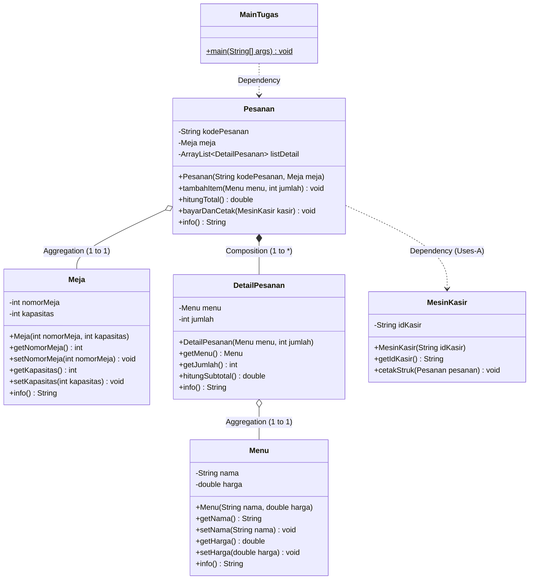

# 📑 LAPORAN PRAKTIKUM PEMROGRAMAN BERORIENTASI OBJEK
## MODUL 4: Relasi Antar Kelas (Class Relationship / Association, Aggregation & Composition)

---

### 👤 Data Praktikan
* **Mata Kuliah** : Pemrograman Berorientasi Objek (OOP)
* **Topik** : Relasi Asosiasi, Agregasi, dan Komposisi antar Objek
* **Paket / Package** : `TugasPraktikum4`
* **Bahasa Pemrograman** : Java

---

## 📝 Pertanyaan dan Jawaban – Percobaan 1 (Relasi Laptop & Processor)

### 1. Di dalam class `Processor` dan class `Laptop`, terdapat method setter dan getter untuk masing-masing atributnya. Apakah gunanya method setter dan getter tersebut?

**Jawaban:**
Method **setter** dan **getter** digunakan sebagai penerapan prinsip **Enkapsulasi (*Encapsulation*)** dan *Data Hiding*:
* **Getter**: Berfungsi untuk **mengambil / membaca (*read/retrieve*)** nilai atribut privat dari luar kelas secara aman tanpa mengekspos variabel aslinya secara langsung (contoh: `getMerk()`, `getProc()`, `getCache()`).
* **Setter**: Berfungsi untuk **mengisi / mengubah (*write/modify*)** nilai atribut privat dari luar kelas dengan kontrol penuh serta memungkinkan penambahan validasi logika jika diperlukan (contoh: `setMerk()`, `setProc()`, `setCache()`).

---

### 2. Di dalam class `Processor` dan class `Laptop`, masing-masing terdapat konstruktor default dan konstruktor berparameter. Bagaimanakah beda penggunaan dari kedua jenis konstruktor tersebut?

**Jawaban:**
* **Konstruktor Default (Tanpa Parameter)**: 
  * Digunakan saat kita ingin menginstansiasi objek kosong terlebih dahulu tanpa langsung mengisi nilai datanya (nilai atribut bernilai default `null` atau `0`).
  * Nilai atribut kemudian diisi secara bertahap menggunakan method *setter*.
  * *Contoh Penggunaan:*
    ```java
    Processor p1 = new Processor();
    p1.setMerk("Intel i5");
    p1.setCache(4);
    ```
* **Konstruktor Berparameter**: 
  * Digunakan saat kita ingin menginstansiasi objek sekaligus langsung memberikan nilai awal (*initial state*) pada atribut-atributnya secara instan dalam satu baris kode.
  * *Contoh Penggunaan:*
    ```java
    Processor p = new Processor("Intel i5", 3);
    Laptop l = new Laptop("Thinkpad", p);
    ```

---

### 3. Perhatikan class `Laptop`, di antara 2 atribut yang dimiliki (`merk` dan `proc`), atribut manakah yang bertipe object? Baris kode manakah yang menunjukkan bahwa class `Laptop` memiliki relasi dengan class `Processor`?

**Jawaban:**
* **Atribut yang bertipe object**:
  * Atribut **`proc`** yang bertipe objek dari class **`Processor`** (selain itu, atribut `merk` yang bertipe `String` juga merupakan class/objek bawaan Java).
* **Baris kode yang menunjukkan relasi dengan class `Processor` pada [Laptop.java](file:///e:/OOP-SMT3/TugasPraktikum4/Laptop.java)**:
  1. **Deklarasi Atribut Relasi:**
     ```java
     private Processor proc;
     ```
  2. **Konstruktor yang Menerima Objek `Processor`:**
     ```java
     public Laptop(String merk, Processor proc) {
         this.merk = merk;
         this.proc = proc;
     }
     ```
  3. **Method Setter dan Getter Relasi:**
     ```java
     public void setProc(Processor proc) {
         this.proc = proc;
     }

     public Processor getProc() {
         return proc;
     }
     ```

---

### 4. Perhatikan pada class `Laptop`, apakah guna dari sintaks `proc.info()`?

**Jawaban:**
Guna dari sintaks `proc.info()` adalah untuk **memanggil method `info()` milik objek `Processor`** yang ditampung dalam atribut `proc`. 

Hal ini menerapkan konsep **Delegasi Tugas (*Task Delegation*)**, di mana class `Laptop` tidak perlu tahu atau menulis ulang logika cara mencetak detail spesifikasi prosesor (seperti merk dan cache), melainkan menyerahkan tanggung jawab pencetakan data prosesor tersebut langsung kepada objek `Processor`-nya.

---

### 5. Pada Langkah 8, objek `p` dibuat lebih dulu baru diberikan ke constructor `Laptop`. Pada Langkah 10, objek `Processor` dibuat langsung di dalam argumen constructor `Laptop` (tanpa variabel `p`). Apakah keduanya menghasilkan output yang berbeda? Mengapa?

**Jawaban:**
* **Apakah menghasilkan output yang berbeda?** **TIDAK**, keduanya menghasilkan output yang sama persis.
* **Alasannya:**
  Karena dalam kedua cara tersebut, objek `Laptop` sama-sama menerima alamat referensi ke suatu *instance* objek `Processor` yang valid di dalam memori.
  * **Cara 1 (dengan variabel `p`)**: Objek `Processor` disimpan dalam variabel referensi `p`, sehingga objek prosesor tersebut dapat diakses/dimanipulasi secara mandiri di luar objek `Laptop`.
  * **Cara 2 (Anonymous Object)**: Objek `Processor` langsung diinstansiasi di dalam parameter (`new Laptop("Thinkpad", new Processor("Intel i5", 3))`), sehingga objek prosesor tersebut hanya bisa diakses melalui objek laptop (`l.getProc()`).

---

### 6. Secara kode, apakah relasi `Laptop`-`Processor` pada percobaan ini termasuk *Aggregation* atau *Composition*? Tunjukkan baris kode yang menjadi bukti jawabanmu!

**Jawaban:**
Relasi pada percobaan ini termasuk ke dalam **Aggregation (Agregasi)** (*relasi Has-A yang bersifat longgar/lemah*).

**Bukti Baris Kode:**
1. **Objek `Processor` dibuat secara independen di luar class `Laptop` lalu disuntikkan (*dependency injection*) melalui konstruktor atau setter:**
   ```java
   // Pada Laptop.java
   public Laptop(String merk, Processor proc) {
       this.merk = merk;
       this.proc = proc;
   }

   public void setProc(Processor proc) {
       this.proc = proc;
   }
   ```
2. **Pembuatan objek di kelas Main:**
   ```java
   // Pada MainPercobaan1.java
   Processor p = new Processor("Intel i5", 3); // Processor hidup mandiri
   Laptop l = new Laptop("Thinkpad", p);       // Processor dipasangkan ke Laptop
   ```
Artinya, siklus hidup (*lifecycle*) objek `Processor` tidak terikat mati dengan objek `Laptop`. Jika objek `Laptop` dihancurkan/dihapus, objek `Processor` (`p`) masih tetap eksis dan dapat digunakan kembali.

---

### 7. Andaikan constructor `Laptop` diubah menjadi seperti berikut, sehingga `Processor` dibuat sendiri di dalam `Laptop`, bukan diterima sebagai parameter:
```java
public Laptop(String merk) {
    this.merk = merk;
    this.proc = new Processor("Generic", 1);
}
```
### Apakah relasi `Laptop`-`Processor` pada versi ini masih *Aggregation*? Jelaskan alasannya!

**Jawaban:**
* **Bukan lagi Aggregation**, relasi pada versi tersebut telah berubah menjadi **Composition (Komposisi)** (*relasi Part-Of yang bersifat kuat*).
* **Alasan:**
  1. **Siklus Hidup Terikat Penuh (*Tight Lifecycle Dependency*)**: Objek `Processor` diciptakan secara internal di dalam konstruktor `Laptop` menggunakan kata kunci `new`.
  2. **Ketergantungan Keberadaan**: Objek `Processor` tidak dapat eksis secara mandiri di luar objek `Laptop`. Objek `Processor` lahir bersamaan saat objek `Laptop` dibuat, dan apabila objek `Laptop` dihancurkan/dihapus dari memori, maka objek `Processor` di dalamnya juga akan ikut musnah.

---

# 📌 PERCOBAAN 2: Agregasi Relasi Ganda (Pelanggan, Mobil, Sopir)

## 📝 Pertanyaan dan Jawaban – Percobaan 2

### 1. Perhatikan class `Pelanggan`. Pada baris program manakah yang menunjukkan bahwa class `Pelanggan` memiliki relasi dengan class `Mobil` dan class `Sopir`?

**Jawaban:**
Relasi ditunjukkan pada beberapa bagian kode di dalam [Pelanggan.java](file:///e:/OOP-SMT3/TugasPraktikum4/AgregasiRelasiGanda/Pelanggan.java):
1. **Deklarasi Atribut Objek Relasi:**
   ```java
   private Mobil mobil; // Relasi Has-A Pelanggan dengan Mobil
   private Sopir sopir; // Relasi Has-A Pelanggan dengan Sopir
   ```
2. **Method Setter dan Getter untuk Objek Relasi:**
   ```java
   public void setMobil(Mobil mobil) {
       this.mobil = mobil;
   }

   public Mobil getMobil() {
       return mobil;
   }

   public void setSopir(Sopir sopir) {
       this.sopir = sopir;
   }

   public Sopir getSopir() {
       return sopir;
   }
   ```

---

### 2. Perhatikan method `hitungBiayaSopir` pada class `Sopir`, serta method `hitungBiayaMobil` pada class `Mobil`. Mengapa method tersebut harus memiliki argument `hari`, padahal `hari` sendiri adalah atribut milik `Pelanggan`, bukan milik `Mobil` atau `Sopir`?

**Jawaban:**
* **Alasan Desain & Fleksibilitas**:
  * Atribut `biaya` pada class `Mobil` dan `Sopir` merupakan **tarif dasar per hari** (nilai statis per entitas).
  * Berapa lama durasi sewa ditentukan oleh transaksi yang dilakukan oleh `Pelanggan`, bukan oleh mobil atau sopir itu sendiri.
  * Agar class `Mobil` dan `Sopir` bersifat fleksibel dan dapat digunakan kembali (*reusable*) untuk berbagai transaksi dengan durasi yang berbeda-beda, maka nilai `hari` harus dikirimkan dari luar sebagai **parameter / argumen input** saat method perhitungan biaya dipanggil.

---

### 3. Perhatikan kode dari class `Pelanggan`. Untuk apakah perintah `mobil.hitungBiayaMobil(hari)` dan `sopir.hitungBiayaSopir(hari)`?

**Jawaban:**
Perintah tersebut berfungsi untuk **mendelegasikan tugas perhitungan sub-total biaya sewa** kepada objek yang bersangkutan:
* **`mobil.hitungBiayaMobil(hari)`**: Meminta objek `Mobil` menghitung total tarif rental mobil berdasarkan durasi hari (`biaya * hari`).
* **`sopir.hitungBiayaSopir(hari)`**: Meminta objek `Sopir` menghitung total tarif jasa sopir berdasarkan durasi hari (`biaya * hari`).

Hasil dari kedua perhitungan delegasi tersebut kemudian dijumlahkan di dalam method `hitungBiayaTotal()` pada class `Pelanggan` untuk menghasilkan total biaya keseluruhan yang harus dibayar.

---

### 4. Perhatikan class `MainPercobaan2`. Untuk apakah sintaks `p.setMobil(m)` dan `p.setSopir(s)`?

**Jawaban:**
Sintaks tersebut berfungsi untuk **menghubungkan / mengasosiasikan (*dependency injection / linking*)** objek `Mobil` (`m` - Avanza) dan objek `Sopir` (`s` - Budi) yang telah dibuat ke dalam objek `Pelanggan` (`p` - Faren).

Dengan pemanggilan method setter tersebut, variabel referensi `mobil` dan `sopir` pada objek `p` (yang awalnya bernilai `null`) kini menunjuk ke alamat objek nyata `m` dan `s` di memori.

---

### 5. Untuk apakah proses `p.hitungBiayaTotal()`?

**Jawaban:**
Proses `p.hitungBiayaTotal()` digunakan untuk **menghitung, menjumlahkan, dan mengembalikan total seluruh biaya transaksi sewa** yang harus dibayar oleh pelanggan `p`.

**Perhitungannya:**
$$\text{Biaya Total} = (\text{Tarif Mobil} \times \text{Hari}) + (\text{Tarif Sopir} \times \text{Hari})$$
$$\text{Biaya Total} = (350.000 \times 2) + (200.000 \times 2) = 700.000 + 400.000 = \mathbf{1.100.000}$$

---

### 6. Pada Langkah 7, `p.getMobil().getMerk()` memanggil dua method sekaligus secara berantai (*method chaining*). Jelaskan urutan eksekusinya: objek apa yang dikembalikan `p.getMobil()`, dan objek apa yang kemudian dipanggil `.getMerk()`-nya?

**Jawaban:**
**Urutan Eksekusi *Method Chaining*:**
1. **Eksekusi Tahap 1 (`p.getMobil()`)**:
   * Method `getMobil()` pada objek `p` dieksekusi terlebih dahulu.
   * Method ini **mengembalikan (*return*) objek bertipe `Mobil`** (yaitu objek `m` yang tersimpan di dalam pelanggan `p`).
2. **Eksekusi Tahap 2 (`.getMerk()`)**:
   * Dari objek `Mobil` yang dikembalikan tersebut, method **`.getMerk()`** langsung dipanggil.
   * Method ini mengembalikan nilai atribut `merk` dari mobil tersebut (bertipe `String`), yaitu menghasilkan teks `"Avanza"`.

---

### 7. Andaikan `p.setMobil(m)` tidak pernah dipanggil lalu `p.hitungBiayaTotal()` dijalankan, error apa yang akan muncul? Jelaskan mengapa error itu terjadi, dikaitkan dengan konsep referensi objek yang sudah kita pelajari sebelumnya!

**Jawaban:**
* **Jenis Error:** **`java.lang.NullPointerException`** (*Runtime Exception*).
* **Penjelasan Konsep Referensi Objek:**
  1. Saat objek `Pelanggan p = new Pelanggan();` dibuat, atribut objek `private Mobil mobil;` secara *default* bernilai **`null`** (belum menunjuk ke alamat objek manapun di memori heap).
  2. Jika `p.setMobil(m)` tidak pernah dipanggil, maka variabel `mobil` tetap bernilai `null`.
  3. Ketika `p.hitungBiayaTotal()` dijalankan, program mengeksekusi instruksi:
     ```java
     return mobil.hitungBiayaMobil(hari) + ...;
     ```
  4. Karena variabel `mobil` masih kosong (`null`), JVM mencoba mengakses method dari variabel yang tidak memiliki objek (*dereferencing a null pointer*), sehingga JVM menghentikan program dan melempar error **`NullPointerException`**.

---

# 📌 PERCOBAAN 3: Agregasi Dua Peran ke Kelas yang Sama (`KeretaApi` & `Pegawai`)

## 📝 Pertanyaan dan Jawaban – Percobaan 3

### 1. Di dalam method `info()` pada class `KeretaApi`, baris `this.masinis.info()` dan `this.asisten.info()` digunakan untuk apa?

**Jawaban:**
Kedua baris tersebut digunakan untuk **mendelegasikan tugas pemformatan data pegawai** (NIP dan Nama) secara langsung kepada objek `Pegawai` yang bersangkutan (`masinis` dan `asisten`):
* `this.masinis.info()`: Memanggil method `info()` dari objek `Pegawai` yang berperan sebagai masinis.
* `this.asisten.info()`: Memanggil method `info()` dari objek `Pegawai` yang berperan sebagai asisten masinis.

Dengan cara ini, class `KeretaApi` tidak perlu menulis ulang kode pengambilan dan pencetakan data pegawai secara manual (`getNip()` dan `getNama()`), melainkan memanfaatkan kembali (*code reuse*) method `info()` milik class `Pegawai`.

---

### 2. Apa hasil output dari `MainPertanyaan` sebelum diperbaiki (Langkah 8)? Mengapa hal tersebut dapat terjadi?

**Jawaban:**
* **Hasil Output:** Program berhenti dengan pesan error **`java.lang.NullPointerException`** (*Runtime Crash*).
* **Penyebab:**
  * Pada `MainPertanyaan`, objek `KeretaApi` diinstansiasi menggunakan konstruktor 3-parameter:
    ```java
    KeretaApi keretaApi = new KeretaApi("Mantap Booyah", "Bisnis", masinis);
    ```
  * Konstruktor 3-parameter ini **hanya menginisialisasi atribut `masinis`**, sedangkan atribut **`asisten` tidak diinisialisasi sehingga tetap bernilai `null`**.
  * Ketika method `keretaApi.info()` dipanggil (sebelum ada perbaikan pengecekan kondisi), program berusaha mengeksekusi `this.asisten.info()`. Karena variabel `asisten` bernilai `null`, JVM melempar error `NullPointerException` karena memanggil method dari objek yang belum dialokasikan di memori (*null reference*).

---

### 3. Kaitkan dengan materi referensi objek: apa isi variabel `asisten` di dalam objek `KeretaApi` yang dibuat lewat constructor 3-parameter, sebelum guard clause ditambahkan?

**Jawaban:**
* **Isi variabel `asisten` adalah `null`**.
* **Kaitan dengan Konsep Referensi Objek:**
  * Dalam Java, variabel dengan tipe data kelas (seperti `Pegawai asisten;`) adalah **variabel referensi** (*reference variable*) yang bertugas menyimpan alamat memori objek di area *heap*.
  * Ketika objek `KeretaApi` dibuat menggunakan konstruktor 3-parameter, atribut `asisten` tidak diberikan referensi objek manapun.
  * Secara *default*, JVM memberikan nilai **`null`** pada semua atribut bertipe referensi yang belum diinisialisasi. Nilai `null` menandakan bahwa variabel tersebut menunjuk ke alamat kosong (*tidak ada instance objek yang dirujuk*).

---

### 4. Setelah guard clause ditambahkan (Langkah 9), apakah objek `masinis` juga perlu dicek dengan cara yang sama? Perhatikan kedua constructor `KeretaApi`, apakah mungkin `masinis` bernilai `null`? Jelaskan!

**Jawaban:**
* **Apakah `masinis` perlu dicek dengan cara yang sama?**
  * Secara kebutuhan alur konstruktor: **Tidak mutlak wajib**, tetapi tetap baik untuk diterapkan sebagai *defensive programming*.
* **Apakah mungkin `masinis` bernilai `null`?**
  * **Berdasarkan Desain Konstruktor**: Pada kedua konstruktor `KeretaApi` (baik 3-parameter maupun 4-parameter), parameter `masinis` **selalu wajib dikirimkan** dan diinisialisasi (`this.masinis = masinis;`). Tidak ada konstruktor yang membiarkan `masinis` tidak diisi.
  * **Berdasarkan Logika Bisnis & Penggunaan**: Kereta api secara aturan operasional **wajib** memiliki masinis agar dapat berjalan, sedangkan asisten masinis bersifat opsional (bisa ada, bisa tidak). Oleh karena itu, *guard clause* `if (this.asisten != null)` mutlak diperlukan untuk asisten.
  * Namun, `masinis` masih *secara teknis* bisa bernilai `null` jika pengguna sengaja memanggil `setMasinis(null)` atau mengirimkan argumen `null` saat instansiasi (`new KeretaApi("Nama", "Bisnis", null)`).

---

### 5. Kelas `Pegawai` dipakai lewat dua atribut berbeda (`masinis` dan `asisten`) pada `KeretaApi`. Apakah ini membuat `KeretaApi` punya dua objek `Pegawai` yang berbeda, atau satu objek `Pegawai` yang dipakai dua kali? Jelaskan berdasarkan kode pada Langkah 6!

**Jawaban:**
* Berdasarkan kode pada Langkah 6 ([MainPercobaan3.java](file:///e:/OOP-SMT3/TugasPraktikum4/Percobaan3AgregasiDuaRoleKeKelasSama/MainPercobaan3.java)), `KeretaApi` memiliki **Dua objek `Pegawai` yang berbeda (dua instance mandiri di memori)**.
* **Penjelasan Berdasarkan Kode:**
  ```java
  Pegawai masinis = new Pegawai("2001", "Spiderman"); // Instansiasi Objek Pegawai 1
  Pegawai asisten = new Pegawai("2002", "Thor");      // Instansiasi Objek Pegawai 2

  KeretaApi keretaApi = new KeretaApi("Mantaap Booyah", "Bisnis", masinis, asisten);
  ```
  * Kata kunci **`new`** dipanggil dua kali secara terpisah, yang berarti sistem mengalokasikan **dua alamat memori yang berbeda di heap**.
  * Objek pertama memiliki *state* (NIP: "2001", Nama: "Spiderman") yang dirujuk oleh variabel `masinis`.
  * Objek kedua memiliki *state* (NIP: "2002", Nama: "Thor") yang dirujuk oleh variabel `asisten`.
  * Kedua objek ini independen dan menempati slot memori masing-masing di dalam objek `KeretaApi`.

---

# 📌 PERCOBAAN 4: Array of Object & Multiplicity (`Gerbong`, `Kursi`, `Penumpang`)

## 📝 Pertanyaan dan Jawaban – Percobaan 4

### 1. Pada main program dalam class `MainPercobaan4`, berapakah jumlah kursi dalam Gerbong A?

**Jawaban:**
Jumlah kursi dalam Gerbong A adalah **10 kursi** (nomor 1 sampai 10).

Hal ini ditentukan saat instansiasi objek `Gerbong` pada [MainPercobaan4.java](file:///e:/OOP-SMT3/TugasPraktikum4/Percobaan4ArrayOfObjectNMultiplicity/MainPercobaan4.java):
```java
Gerbong gerbong = new Gerbong("A", 10); // Parameter kedua '10' mengalokasikan array berisi 10 elemen Kursi
```

---

### 2. Perhatikan potongan kode `if (this.penumpang != null) { ... }` pada method `info()` dalam class `Kursi`. Apa maksud kode tersebut?

**Jawaban:**
Kode tersebut merupakan sebuah **Guard Clause / Pengecekan Kondisi (*Null-Safety*)** yang bertujuan untuk:
* Memeriksa apakah kursi tersebut **sudah memiliki penumpang atau masih kosong**.
* Jika kursi **terisi** (`penumpang != null`), method `penumpang.info()` akan dipanggil untuk menampilkan data penumpang (KTP dan Nama).
* Jika kursi **kosong** (`penumpang == null`), pemanggilan `penumpang.info()` akan dilewati, sehingga **mencegah terjadinya error fatal `java.lang.NullPointerException`**.

---

### 3. Mengapa pada method `setPenumpang()` dalam class `Gerbong`, nilai nomor dikurangi dengan angka 1 (`nomor - 1`)?

**Jawaban:**
Karena **indeks array dalam Java berbasis nol (*zero-based indexing*)**, yaitu elemen array diakses mulai dari indeks `0` hingga `length - 1`. Sedangkan dalam sistem dunia nyata (serta input pengguna), penomoran kursi dimulai dari angka **1**.

* **Pemetaannya:**
  * Kursi nomor `1` dipetakan ke indeks `arrayKursi[1 - 1]` = `arrayKursi[0]`.
  * Kursi nomor `2` dipetakan ke indeks `arrayKursi[2 - 1]` = `arrayKursi[1]`.
  * Kursi nomor `10` dipetakan ke indeks `arrayKursi[10 - 1]` = `arrayKursi[9]`.

---

### 4. Instansiasi objek baru `budi` dengan tipe `Penumpang`, kemudian masukkan objek baru tersebut pada gerbong dengan `gerbong.setPenumpang(budi, 1)`, menimpa penumpang lama yang sudah duduk di sana. Apakah yang terjadi? Apakah Java memberi peringatan/error?

**Jawaban:**
* **Yang Terjadi:** 
  Objek penumpang lama yang berada di kursi nomor 1 **langsung tertimpa (*overwritten*)** dan digantikan posisinya oleh objek `budi`. Saat `gerbong.info()` dijalankan, kursi nomor 1 akan menampilkan data penumpang baru (`budi`).
* **Apakah Java Memberi Peringatan/Error?**
  **TIDAK.** Java tidak memberikan peringatan (*warning*) ataupun error saat kompilasi maupun saat *runtime*. Secara sintaksis Java, menimpa alamat referensi objek lama dengan objek baru pada suatu variabel (`this.penumpang = penumpang;`) adalah operasi penugasan (*assignment*) yang sah, kecuali pemrogram secara eksplisit menambahkan logika validasi pencegahan.

---

### 5. Modifikasi program sehingga tidak diperkenankan menduduki kursi yang sudah ada penumpang lain (tambahkan pengecekan pada `Gerbong.setPenumpang()` sebelum baris `arrayKursi[nomor - 1].setPenumpang(...)` dijalankan)!

**Jawaban:**
Pada class [Gerbong.java](file:///e:/OOP-SMT3/TugasPraktikum4/Percobaan4ArrayOfObjectNMultiplicity/Gerbong.java), method `setPenumpang()` dimodifikasi dengan menambahkan validasi ketersediaan kursi (`arrayKursi[nomor - 1].getPenumpang() != null`):

#### 🔹 Kode Hasil Modifikasi pada `Gerbong.java`:
```java
public void setPenumpang(Penumpang penumpang, int nomor) {
    // Validasi range nomor kursi
    if (nomor < 1 || nomor > this.arrayKursi.length) {
        System.out.println("Peringatan: Nomor kursi " + nomor + " tidak valid!");
        return;
    }

    // Pengecekan apakah kursi sudah terisi
    if (this.arrayKursi[nomor - 1].getPenumpang() != null) {
        System.out.println("Gagal: Kursi nomor " + nomor + " sudah ditempati oleh " + 
                           this.arrayKursi[nomor - 1].getPenumpang().getNama() + "!");
    } else {
        this.arrayKursi[nomor - 1].setPenumpang(penumpang);
        System.out.println("Berhasil memesan kursi nomor " + nomor + " untuk " + penumpang.getNama());
    }
}
```

---

### 6. Bandingkan tiga bentuk relasi *has-a* yang sudah kita praktikkan: `Laptop`-`Processor` (Percobaan 1, 1-1), `KeretaApi`-`Pegawai` (Percobaan 3, dua relasi 1-1 bernama), dan `Gerbong`-`Kursi` (Percobaan 4, 1..\*). Untuk kasus seperti apa kita akan memilih array, dan untuk kasus seperti apa kita akan memilih atribut bernama satu-satu?

**Jawaban:**
* **Kapan Memilih Atribut Bernama Satu-satu (Individual Named Attributes / Relasi 1-1):**
  * Digunakan ketika jumlah relasi objek **sedikit, tetap, dan terdefinisi pasti** (biasanya 1 atau 2).
  * Setiap objek relasi memiliki **peran semantik (*role*) yang berbeda dan spesifik**.
  * *Contoh:*
    * `Laptop` hanya memiliki satu `Processor` (`private Processor proc;`).
    * `KeretaApi` memiliki dua peran berbeda yang tidak boleh tertukar: `private Pegawai masinis;` dan `private Pegawai asisten;`.
    * `Pelanggan` memiliki `private Mobil mobil;` dan `private Sopir sopir;`.

* **Kapan Memilih Array / Koleksi (Array of Object / Multiplicity 1..\*):**
  * Digunakan ketika relasi berjumlah **majemuk / banyak (satu ke banyak / 1..\*)**.
  * Objek-objek yang berelasi bertipe **seragam (homogen)** dan memiliki peran/fungsi yang sama persis tanpa perlu nama variabel khusus untuk setiap entitasnya.
  * Memungkinkan pemrosesan data secara berulang (*looping* / iterasi) menggunakan indeks atau *for-each*.
  * *Contoh:*
    * `Gerbong` menampung sekumpulan kursi (`private Kursi[] arrayKursi;`).
    * `Toko` menampung daftar barang (`Barang[] listBarang`), atau `Jurusan` menampung banyak mahasiswa (`Mahasiswa[] daftarMahasiswa`).

---

### 7. Terapkan kriteria kode (*siapa yang memanggil new*) pada dua relasi *has-a* di Percobaan ini: `Gerbong`-`Kursi` dan `Kursi`-`Penumpang`. Manakah yang *Aggregation* dan manakah yang *Composition*? Tunjukkan baris kode yang menjadi bukti untuk masing-masing!

**Jawaban:**

#### A. Relasi `Gerbong` - `Kursi` $\rightarrow$ **COMPOSITION (Komposisi)**
* **Bukti Baris Kode pada [Gerbong.java](file:///e:/OOP-SMT3/TugasPraktikum4/Percobaan4ArrayOfObjectNMultiplicity/Gerbong.java):**
  ```java
  public Gerbong(String kode, int jumlahKursi) {
      this.kode = kode;
      this.arrayKursi = new Kursi[jumlahKursi];
      this.intKursi();
  }

  private void intKursi() {
      for (int i = 0; i < this.arrayKursi.length; i++) {
          this.arrayKursi[i] = new Kursi(String.valueOf(i + 1)); // Objek Kursi dibuat di dalam Gerbong
      }
  }
  ```
* **Alasan:**
  * Objek `Kursi` diinstansiasi langsung **di dalam class `Gerbong`** menggunakan kata kunci `new`.
  * Siklus hidup (*lifecycle*) objek `Kursi` **terikat mati** dengan `Gerbong`. `Kursi` tidak bisa eksis sendiri tanpa adanya `Gerbong`. Jika objek `Gerbong` dihancurkan dari memori, maka seluruh objek `Kursi` di dalamnya ikut musnah.

---

#### B. Relasi `Kursi` - `Penumpang` $\rightarrow$ **AGGREGATION (Agregasi)**
* **Bukti Baris Kode pada [MainPercobaan4.java](file:///e:/OOP-SMT3/TugasPraktikum4/Percobaan4ArrayOfObjectNMultiplicity/MainPercobaan4.java) & [Kursi.java](file:///e:/OOP-SMT3/TugasPraktikum4/Percobaan4ArrayOfObjectNMultiplicity/Kursi.java):**
  ```java
  // Pada MainPercobaan4.java
  Penumpang p = new Penumpang("1234", "Mr.Wawan"); // Objek Penumpang dibuat di luar Kursi
  gerbong.setPenumpang(p, 1);                      // Objek Penumpang dipasangkan ke Kursi

  // Pada Kursi.java
  public void setPenumpang(Penumpang penumpang) {
      this.penumpang = penumpang; // Hanya menerima referensi
  }
  ```
* **Alasan:**
  * Objek `Penumpang` diciptakan secara **independen di luar class `Kursi`** (di kelas Main) lalu direferensikan ke dalam kursi melalui method `setPenumpang()`.
  * Siklus hidup objek `Penumpang` **bebas dan mandiri**. Jika objek `Gerbong` atau `Kursi` dihancurkan, objek `Penumpang` (`p`) masih tetap ada di memori dan dapat berelasi dengan objek lain.

---

# 📌 PERCOBAAN 5: Relasi Komposisi / Composition (`Mobil` & `Mesin`)

## 📝 Pertanyaan dan Jawaban – Percobaan 5

### 1. Pada class `Mobil`, baris manakah yang menunjukkan bahwa `Mesin` adalah bagian yang “dimiliki secara eksklusif” oleh `Mobil` (bukan sekadar “dipinjam”)?

**Jawaban:**
Baris yang menunjukkan kepemilikan eksklusif terdapat pada konstruktor di dalam [Mobil.java](file:///e:/OOP-SMT3/TugasPraktikum4/Percobaan5Composition/Mobil.java):
```java
public Mobil(String merek) {
    this.merek = merek;
    this.mesin = new Mesin(); // 👉 Baris ini menunjukkan Composition murni
}
```
**Penjelasannya:**
Objek `Mesin` diinstansiasi secara internal langsung di dalam tubuh konstruktor `Mobil` saat objek `Mobil` diciptakan. Objek `Mesin` tidak diterima dari luar kelas, melainkan dilahirkan dan dikelola sepenuhnya secara privat oleh `Mobil`.

---

### 2. Apa yang terjadi secara desain jika ditambahkan method `setMesin(Mesin mesin)` pada class `Mobil`? Apakah relasi ini akan tetap menjadi Composition? Jelaskan!

**Jawaban:**
* **Dampak Desain:** Integritas relasi **Komposisi Murni (*Pure Composition*) akan rusak / melemah**.
* **Apakah tetap Composition?** **TIDAK**, relasinya akan bergeser menjadi **Aggregation (atau komposisi semu/hibrida)**.
* **Alasan:**
  Method setter (`setMesin`) memberikan celah bagi pihak luar untuk mengganti atau menyuntikkan objek `Mesin` yang dibuat di luar kelas `Mobil`. Akibatnya:
  1. Objek `Mobil` tidak lagi memegang kendali penuh atas penciptaan siklus hidup (*lifecycle*) objek `Mesin`.
  2. Objek `Mesin` tersebut bisa diakses dan direferensikan oleh variabel lain di luar `Mobil`, sehingga kepemilikan eksklusifnya hilang.

---

### 3. Bandingkan dengan Percobaan 1 (`Laptop`-`Processor`): sebutkan satu perbedaan baris kode yang membuat salah satunya *Aggregation* dan yang lain *Composition*!

**Jawaban:**
Perbedaan mendasar terletak pada **lokasi dan cara pemanggilan kata kunci `new`**:

* **Pada Percobaan 1 (Aggregation - [Laptop.java](file:///e:/OOP-SMT3/TugasPraktikum4/Laptop.java)):**
  ```java
  public Laptop(String merk, Processor proc) {
      this.proc = proc; // Menerima objek yang sudah dibuat di luar (Aggregation)
  }
  ```
* **Pada Percobaan 5 (Composition - [Mobil.java](file:///e:/OOP-SMT3/TugasPraktikum4/Percobaan5Composition/Mobil.java)):**
  ```java
  public Mobil(String merek) {
      this.mesin = new Mesin(); // Membuat objek sendiri secara internal (Composition)
  }
  ```

---

### 4. Jika objek `mobil` di `MainPercobaan5` di-set `null` setelah `tampilkanInfo()` dipanggil, apa yang terjadi pada objek `Mesin` miliknya? Bandingkan dengan nasib objek `Processor` pada Percobaan 1 seandainya objek `Laptop`-nya dihapus, apakah `Processor` tersebut masih bisa “diselamatkan” oleh kode lain? Kenapa `Mesin` tidak bisa?

**Jawaban:**
* **Nasib objek `Mesin` saat `mobil = null;`:**
  Objek `Mesin` yang ada di dalamnya akan kehilangan satu-satunya referensi yang menunjuk kepadanya (*unreachable*), sehingga objek `Mesin` tersebut otomatis **dihancurkan dan dibersihkan dari memori oleh Garbage Collector (GC)** Java.
* **Perbandingan dengan Percobaan 1 (`Laptop`-`Processor`):**
  * Pada Percobaan 1: Objek `Processor` dibuat dan disimpan terlebih dahulu dalam variabel `Processor p = new Processor(...);`. Jika objek `laptop = null;`, objek `Processor` **masih bisa diselamatkan dan tetap hidup** karena masih direferensikan oleh variabel `p`.
* **Kenapa `Mesin` pada Percobaan 5 tidak bisa diselamatkan?**
  * Karena objek `Mesin` diciptakan langsung di dalam `Mobil` tanpa pernah menyerahkan atau mengekspos alamat referensinya ke variabel luar. Variabel pemegang referensi satu-satunya hanyalah atribut `private Mesin mesin;` milik `Mobil`. Ketika `Mobil` dimatikan (`null`), seluruh akses ke `Mesin` lenyap seketika.

---

### 5. Coba tambahkan constructor kedua pada `Mobil` yang menerima parameter `Mesin`:
```java
public Mobil(String merek, Mesin mesin) {
    this.merek = merek;
    this.mesin = mesin;
}
```
### Kalau constructor ini yang dipakai, apakah `Mobil`-`Mesin` berubah menjadi *Aggregation*? Jelaskan alasannya!

**Jawaban:**
* **Ya, relasi akan berubah menjadi Aggregation (Agregasi).**
* **Alasan:**
  1. **Inisialisasi dari Luar:** Objek `Mesin` harus dibuat secara independen terlebih dahulu di luar class `Mobil` (misalnya di kelas Main: `Mesin m = new Mesin(); Mobil mobil = new Mobil("Avanza", m);`).
  2. **Siklus Hidup Mandiri (*Independent Lifecycle*):** Objek `Mesin` tidak lagi terikat mati dengan `Mobil`. Objek `Mesin` bisa eksis sebelum `Mobil` dibuat, dan jika objek `Mobil` dihancurkan, objek `Mesin` (`m`) tetap eksis dan dapat dipasangkan ke objek `Mobil` lainnya.

---

# 📌 PERCOBAAN 6: Relasi Dependensi / Dependency (*Uses-A*) (`Laptop` & `Printer`)

## 📝 Pertanyaan dan Jawaban – Percobaan 6

### 1. Apakah class `Laptop` pada percobaan ini memiliki atribut bertipe `Printer`? Bandingkan dengan Percobaan 1, di mana `Processor` disimpan sebagai atribut `Laptop`!

**Jawaban:**
* **Tidak.** Class [Laptop.java](file:///e:/OOP-SMT3/TugasPraktikum4/Percobaan6DepedencyUSESa/Laptop.java) pada percobaan ini **sama sekali tidak memiliki atribut bertipe `Printer`**. Class `Laptop` hanya memiliki satu atribut, yaitu `private String merk;`.
* **Perbandingannya dengan Percobaan 1:**
  * **Pada Percobaan 1 (Aggregation / *Has-A*):** Objek `Processor` disimpan sebagai atribut kelas yang permanen (`private Processor proc;`). Artinya, `Laptop` secara struktural "memiliki" prosesor tersebut selama masa hidup objek laptop.
  * **Pada Percobaan 6 (Dependency / *Uses-A*):** Objek `Printer` tidak dimiliki oleh `Laptop`, melainkan hanya diteruskan sebagai **parameter sementara** pada method `cetakDokumen(Printer printer, String namaFile)`.

---

### 2. Setelah method `cetakDokumen()` selesai dijalankan, apakah `Laptop` masih menyimpan referensi ke objek `printer` yang tadi dipakai? Jelaskan berdasarkan baris kode class `Laptop`!

**Jawaban:**
* **Tidak**, `Laptop` tidak lagi menyimpan referensi ke objek `Printer`.
* **Penjelasan Berdasarkan Kode:**
  ```java
  public void cetakDokumen(Printer printer, String namaFile) {
      System.out.println(merk + " Mengirim dokumen ke printer...");
      printer.cetak(namaFile);
  }
  ```
  * Variabel `printer` pada method di atas bertindak sebagai **variabel lokal / parameter** yang dialokasikan di dalam memori *stack*.
  * Ketika instruksi method `cetakDokumen()` selesai dieksekusi, *stack frame* dari method tersebut langsung dihapus (*popped*).
  * Karena nilai variabel `printer` tidak pernah disimpan ke dalam variabel instan / atribut kelas (`this.printer = ...`), maka `Laptop` kehilangan seluruh keterikatan dan alamat referensi ke objek `Printer` tersebut begitu method selesai berjalan.

---

### 3. Mengapa relasi `Laptop`-`Printer` pada percobaan ini disebut *Dependency (uses-a)*, bukan *Aggregation*, meskipun sama-sama melibatkan dua objek yang saling berinteraksi?

**Jawaban:**
* **Sifat Interaksi Bersifat Sementara (*Transient / Short-Lived*):**
  * Pada **Aggregation (*has-a*)**: Hubungan bersifat struktural dan jangka panjang. Objek disimpan sebagai atribut kelas sehingga kelas induk selalu memiliki referensi ke objek tersebut.
  * Pada **Dependency (*uses-a*)**: Hubungan bersifat operasional dan hanya berlangsung **sesaat (*temporary*)** selama method dipanggil. `Laptop` hanya "meminjam/menggunakan" `Printer` untuk menyelesaikan tugas mencetak dokumen, tanpa menjadikan printer sebagai bagian dari identitas/keadaan (*state*) dari objek `Laptop`.
* **Kemandirian Objek:** Objek `Laptop` dapat berfungsi seutuhnya tanpa adanya `Printer`, dan siklus hidup kedua objek sama sekali tidak saling mengikat secara struktural.

---

### 4. Coba ubah kode `Laptop` supaya `Printer` disimpan sebagai atribut (mis. `private Printer printerDefault`, diisi lewat constructor atau setter, lalu dipakai kembali di `cetakDokumen()` tanpa parameter `Printer`). Apakah relasi ini sekarang berubah dari Dependency menjadi Aggregation? Jelaskan!

**Jawaban:**
* **Ya, relasi akan berubah dari Dependency menjadi Aggregation (Agregasi).**
* **Alasan:**
  1. **Tercatat sebagai Atribut Kelas:** Dengan mendeklarasikan `private Printer printerDefault;`, `Laptop` kini memiliki hubungan kepemilikan struktural (*has-a*) terhadap objek printer tersebut.
  2. **Referensi Tersimpan Jangka Panjang:** Objek `Printer` dibuat di luar kelas `Laptop` (independen) lalu disuntikkan via konstruktor atau setter. Selama objek `Laptop` masih ada di memori, referensi ke `printerDefault` akan terus dipertahankan, yang merupakan ciri utama dari relasi **Aggregation**.

---

### 5. Lengkapi tabel berikut: untuk masing-masing dari *Aggregation*, *Composition*, dan *Dependency*, sebutkan (a) apakah objek part disimpan sebagai atribut atau tidak, dan (b) siapa yang memanggil `new` untuk membuat objek part tersebut!

**Jawaban:**

| Jenis Relasi | (a) Apakah Objek Disimpan sebagai Atribut Kelas? | (b) Siapa yang Memanggil `new` untuk Membuat Objek? | Karakteristik / Sifat Relasi |
| :--- | :--- | :--- | :--- |
| **Aggregation** (*Has-A*) | **Ya**, disimpan sebagai atribut kelas induk (*whole*). | **Pihak Luar (Kelas Main / Client)**, lalu objek disuntikkan lewat konstruktor atau setter. | Relasi kepemilikan longgar; siklus hidup kedua objek mandiri/independen satu sama lain. |
| **Composition** (*Part-Of*) | **Ya**, disimpan sebagai atribut kelas induk (*whole*). | **Kelas Induk itu Sendiri (secara internal)** di dalam konstruktor atau method internalnya. | Relasi kepemilikan kuat / terikat mati; siklus hidup objek bagian bergantung penuh pada kelas induk. |
| **Dependency** (*Uses-A*) | **Tidak**, hanya menjadi parameter method, variabel lokal, atau nilai kembalian (*return type*). | **Pihak Luar (Kelas Main / Client)** atau dibuat sesaat di dalam method. | Relasi penggunaan sementara (*transient*); hanya terhubung saat pemanggilan method berlangsung. |

---

# 📌 TUGAS MANDIRI: Studi Kasus Sistem Pemesanan Kafe (*Smart Cafe Order*)

---

## ☕ 1. Deskripsi Studi Kasus & Class Diagram

### A. Deskripsi Sistem:
Sistem ini memodelkan proses pemesanan menu pada sebuah kafe modern yang melibatkan 5 class utama:
1. **`Menu`**: Menyimpan data makanan/minuman (nama dan harga).
2. **`Meja`**: Menyimpan data meja pelanggan (nomor meja dan kapasitas).
3. **`DetailPesanan`**: Menyimpan rincian item pesanan (objek `Menu`, kuantitas, dan kalkulasi subtotal).
4. **`Pesanan`**: Mengelola transaksi pemesanan (kode pesanan, objek `Meja`, serta kumpulan `DetailPesanan`).
5. **`MesinKasir`**: Perangkat operasional kasir untuk mencetak struk transaksi pembayaran.

---

### B. Class Diagram (UML):



---

## 🔍 2. Identifikasi Ketiga Jenis Relasi & Bukti Kode

### 🔴 A. Relasi COMPOSITION (*Part-Of*): `Pesanan` $\rightarrow$ `DetailPesanan`
* **Bukti Kode pada [Pesanan.java](file:///e:/OOP-SMT3/TugasPraktikum4/TugasMandiriKafe/Pesanan.java):**
  ```java
  public class Pesanan {
      private ArrayList<DetailPesanan> listDetail; // Disimpan sebagai atribut koleksi

      public void tambahItem(Menu menu, int jumlah) {
          // 👉 Instansiasi objek DetailPesanan terjadi langsung di dalam class Pesanan
          DetailPesanan item = new DetailPesanan(menu, jumlah);
          listDetail.add(item);
      }
  }
  ```
* **Alasan:**
  Objek `DetailPesanan` (rincian item nota) diciptakan secara internal di dalam method `tambahItem()` milik `Pesanan`. Siklus hidup `DetailPesanan` **terikat mati** dengan objek `Pesanan`. Jika objek `Pesanan` dihapus/dibatalkan dari sistem, maka seluruh rincian `DetailPesanan` di dalamnya otomatis ikut musnah.

---

### 🟡 B. Relasi AGGREGATION (*Has-A*): `Pesanan` $\rightarrow$ `Meja` (dan `DetailPesanan` $\rightarrow$ `Menu`)
* **Bukti Kode pada [Pesanan.java](file:///e:/OOP-SMT3/TugasPraktikum4/TugasMandiriKafe/Pesanan.java) & [MainTugas.java](file:///e:/OOP-SMT3/TugasPraktikum4/TugasMandiriKafe/MainTugas.java):**
  ```java
  // Pada Pesanan.java
  public class Pesanan {
      private Meja meja; // Disimpan sebagai atribut relasi

      public Pesanan(String kodePesanan, Meja meja) {
          this.kodePesanan = kodePesanan;
          this.meja = meja; // 👉 Objek Meja diterima dari luar (Dependency Injection)
      }
  }

  // Pada MainTugas.java
  Meja meja7 = new Meja(7, 4);                   // Meja dibuat mandiri di luar
  Pesanan order1 = new Pesanan("ORD-001", meja7); // Meja dipasangkan ke pesanan
  ```
* **Alasan:**
  Objek `Meja` dan `Menu` dibuat secara **mandiri/independen** di luar kelas `Pesanan`. Objek `Meja` nomor 7 tetap ada dan utuh di kafe meskipun `Pesanan` telah selesai atau dihapus dari memori. Hubungan kepemilikannya bersifat longgar (*loose coupling*).

---

### 🔵 C. Relasi DEPENDENCY (*Uses-A*): `Pesanan` $\rightarrow$ `MesinKasir`
* **Bukti Kode pada [Pesanan.java](file:///e:/OOP-SMT3/TugasPraktikum4/TugasMandiriKafe/Pesanan.java):**
  ```java
  public class Pesanan {
      // TIDAK ADA atribut private MesinKasir kasir di sini!

      // 👉 Objek MesinKasir hanya hadir sesaat sebagai parameter method
      public void bayarDanCetak(MesinKasir kasir) {
          System.out.println("Memproses pembayaran untuk " + kodePesanan + "...");
          kasir.cetakStruk(this);
      }
  }
  ```
* **Alasan:**
  Class `Pesanan` tidak menyimpan objek `MesinKasir` sebagai atribut permanen. `Pesanan` hanya **menggunakan (*uses*)** `MesinKasir` sebagai parameter sementara untuk mencetak struk transaksi saat method `bayarDanCetak()` dipanggil. Begitu method selesai dijalankan, referensi ke `MesinKasir` langsung terputus dari objek `Pesanan`.

---

## 💻 3. Source Code Lengkap Program

### 🔹 A. `Menu.java`
```java
package TugasPraktikum4.TugasMandiriKafe;

public class Menu {
    private String nama;
    private double harga;

    public Menu(String nama, double harga) {
        this.nama = nama;
        this.harga = harga;
    }

    public String getNama() {
        return nama;
    }

    public void setNama(String nama) {
        this.nama = nama;
    }

    public double getHarga() {
        return harga;
    }

    public void setHarga(double harga) {
        this.harga = harga;
    }

    public String info() {
        return nama + " (Rp " + String.format("%,.0f", harga) + ")";
    }
}
```

---

### 🔹 B. `Meja.java`
```java
package TugasPraktikum4.TugasMandiriKafe;

public class Meja {
    private int nomorMeja;
    private int kapasitas;

    public Meja(int nomorMeja, int kapasitas) {
        this.nomorMeja = nomorMeja;
        this.kapasitas = kapasitas;
    }

    public int getNomorMeja() {
        return nomorMeja;
    }

    public void setNomorMeja(int nomorMeja) {
        this.nomorMeja = nomorMeja;
    }

    public int getKapasitas() {
        return kapasitas;
    }

    public void setKapasitas(int kapasitas) {
        this.kapasitas = kapasitas;
    }

    public String info() {
        return "Meja #" + nomorMeja + " (Kapasitas: " + kapasitas + " orang)";
    }
}
```

---

### 🔹 C. `DetailPesanan.java`
```java
package TugasPraktikum4.TugasMandiriKafe;

public class DetailPesanan {
    private Menu menu; // 🟡 Aggregation terhadap Menu
    private int jumlah;

    public DetailPesanan(Menu menu, int jumlah) {
        this.menu = menu;
        this.jumlah = jumlah;
    }

    public Menu getMenu() {
        return menu;
    }

    public int getJumlah() {
        return jumlah;
    }

    public double hitungSubtotal() {
        return menu.getHarga() * jumlah;
    }

    public String info() {
        return "- " + menu.getNama() + " x" + jumlah + " = Rp " + String.format("%,.0f", hitungSubtotal());
    }
}
```

---

### 🔹 D. `MesinKasir.java`
```java
package TugasPraktikum4.TugasMandiriKafe;

public class MesinKasir {
    private String idKasir;

    public MesinKasir(String idKasir) {
        this.idKasir = idKasir;
    }

    public String getIdKasir() {
        return idKasir;
    }

    public void cetakStruk(Pesanan pesanan) {
        System.out.println("\n=========================================");
        System.out.println("          STRUK PEMBAYARAN KAFE          ");
        System.out.println("  Kasir ID: " + idKasir);
        System.out.println("=========================================");
        System.out.println(pesanan.info());
        System.out.println("=========================================");
        System.out.println("       TERIMA KASIH ATAS KUNJUNGANNYA!   ");
        System.out.println("=========================================\n");
    }
}
```

---

### 🔹 E. `Pesanan.java`
```java
package TugasPraktikum4.TugasMandiriKafe;

import java.util.ArrayList;

public class Pesanan {
    private String kodePesanan;
    private Meja meja;                                  // 🟡 Aggregation (Has-A)
    private ArrayList<DetailPesanan> listDetail;        // 🔴 Composition (Part-Of)

    public Pesanan(String kodePesanan, Meja meja) {
        this.kodePesanan = kodePesanan;
        this.meja = meja;
        this.listDetail = new ArrayList<>();
    }

    // 🔴 Composition: Objek DetailPesanan dibuat langsung di dalam Pesanan
    public void tambahItem(Menu menu, int jumlah) {
        DetailPesanan item = new DetailPesanan(menu, jumlah);
        listDetail.add(item);
    }

    public double hitungTotal() {
        double total = 0;
        for (DetailPesanan item : listDetail) {
            total += item.hitungSubtotal();
        }
        return total;
    }

    // 🔵 Dependency: MesinKasir digunakan sesaat via parameter
    public void bayarDanCetak(MesinKasir kasir) {
        System.out.println("Memproses pembayaran untuk " + kodePesanan + "...");
        kasir.cetakStruk(this);
    }

    public String info() {
        StringBuilder sb = new StringBuilder();
        sb.append("Kode Pesanan : ").append(kodePesanan).append("\n");
        sb.append("Lokasi       : ").append(meja.info()).append("\n");
        sb.append("Daftar Menu  :\n");
        for (DetailPesanan item : listDetail) {
            sb.append("  ").append(item.info()).append("\n");
        }
        sb.append("Total Bayar  : Rp ").append(String.format("%,.0f", hitungTotal()));
        return sb.toString();
    }
}
```

---

### 🔹 F. `MainTugas.java`
```java
package TugasPraktikum4.TugasMandiriKafe;

public class MainTugas {
    public static void main(String[] args) {
        // 1. Objek Mandiri (Menu dan Meja)
        Menu m1 = new Menu("Espresso Double Shot", 25000);
        Menu m2 = new Menu("Caramel Macchiato", 35000);
        Menu m3 = new Menu("Croissant Butter", 28000);

        Meja meja7 = new Meja(7, 4);

        // 2. Relasi AGGREGATION: Meja dipasangkan ke Pesanan
        Pesanan order1 = new Pesanan("ORD-2026-001", meja7);

        // 3. Relasi COMPOSITION: DetailPesanan dibuat di dalam Pesanan melalui method tambahItem
        order1.tambahItem(m1, 2); // 2 Espresso
        order1.tambahItem(m2, 1); // 1 Caramel Macchiato
        order1.tambahItem(m3, 3); // 3 Croissant

        // 4. Relasi DEPENDENCY: Pesanan menggunakan MesinKasir sesaat untuk bayar & cetak struk
        MesinKasir kasirUtama = new MesinKasir("KASIR-LANTAI-1");
        order1.bayarDanCetak(kasirUtama);
    }
}
```

---

### 💻 Hasil Output Running Program:
```text
Memproses pembayaran untuk ORD-2026-001...

=========================================
          STRUK PEMBAYARAN KAFE          
  Kasir ID: KASIR-LANTAI-1
=========================================
Kode Pesanan : ORD-2026-001
Lokasi       : Meja #7 (Kapasitas: 4 orang)
Daftar Menu  :
  - Espresso Double Shot x2 = Rp 50.000
  - Caramel Macchiato x1 = Rp 35.000
  - Croissant Butter x3 = Rp 84.000
Total Bayar  : Rp 169.000
=========================================
       TERIMA KASIH ATAS KUNJUNGANNYA!   
=========================================
```

---

## ❓ 4. Jawaban Pertanyaan Nomor 2 (Kriteria Pengambilan Keputusan Relasi)

### Pertanyaan:
> *Dalam merancang sistem barumu sendiri, bagaimana kita memutuskan sebuah relasi antar class seharusnya Aggregation, Composition, atau Dependency? Sebutkan pertanyaan kunci yang kita ajukan ke diri sendiri saat memutuskan.*

### Jawaban:
Untuk memutuskan jenis relasi yang tepat, kita menganalisis **jangka waktu kepemilikan** dan **keterikatan siklus hidup (*lifecycle*)** antar objek melalui 3 pertanyaan kunci:

1. **Pertanyaan 1 (Cek Dependency):** 
   > *"Apakah class A hanya membutuhkan class B sesaat untuk menjalankan satu fungsi operasional tertentu tanpa perlu menjadikannya atribut permanen?"*
   * Jika **YA** $\rightarrow$ Gunakan **Dependency (*Uses-A*)** dengan memasukkan class B sebagai parameter method atau variabel lokal.

2. **Pertanyaan 2 (Cek Aggregation):**
   > *"Apakah class A 'memiliki' class B sebagai atribut, tetapi class B dapat diciptakan mandiri dan tetap eksis meskipun class A dimusnahkan?"*
   * Jika **YA** $\rightarrow$ Gunakan **Aggregation (*Has-A*)** dengan membuat objek B di luar lalu disuntikkan via konstruktor atau setter.

3. **Pertanyaan 3 (Cek Composition):**
   > *"Apakah class B merupakan bagian utuh tak terpisahkan (*part-of*) dari class A yang lahir dan mati bersama class A?"*
   * Jika **YA** $\rightarrow$ Gunakan **Composition (*Part-Of*)** dengan menginstansiasi `new B()` secara internal langsung di dalam class A.

---

## 🎓 5. Cheat Sheet / Rangkuman Cepat untuk Persiapan Quiz Besok 🚀

| Relasi | Simbol UML | Kata Kunci | Ciri Khas pada Kode Java | Contoh Nyata |
| :--- | :---: | :---: | :--- | :--- |
| **Dependency** | `..>` (Garis putus panah terbuka) | *Uses-A* (Menggunakan) | Objek **TIDAK** jadi atribut; hanya jadi **parameter method** (`void cetak(Printer p)`). | Laptop menggunakan Printer. |
| **Aggregation** | `o--` (Belah ketupat putih/kosong) | *Has-A* (Memiliki longgar) | Objek **JADI atribut**; `new` dipanggil **di luar kelas** (via constructor/setter parameter). | Pesanan memiliki Meja; Mobil memiliki Sopir. |
| **Composition** | `*--` (Belah ketupat hitam/penuh) | *Part-Of* (Bagian terikat mati) | Objek **JADI atribut**; `new` dipanggil **di dalam kelas induk** (`this.mesin = new Mesin()`). | Mobil memiliki Mesin; Pesanan memiliki DetailPesanan. |

---
